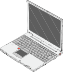
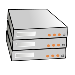

Relax-and-Recover (ReaR) is a setup-and-forget *Linux bare metal disaster recovery* solution.
It is easy to set up and requires no maintenance so there is no excuse for not using it.

Learn more about Relax-and-Recover from the selected usage scenarios below:

<table>
<tr>
    <th>Home user</th> <th>Enterprise user</th>
</tr>
<tr class="images">
    <td></td> <td></td>
</tr>
<tr>
<td>
    <ul>
        <li>recover from a broken hard disk using a <a href="usage/#recovery_from_usb">bootable USB stick</a></li>
        <li>recover a broken system from your <a href="usage/#rescue_system">bootloader</a></li>
    </ul>
</td>
<td>
    <ul>
        <li>collect small ISO images on a <a href="usage/#storing_on_a_central_nfs_server">central server</a></li>
        <li>integrate with your <a href="usage/#backup_integration">backup solution</a></li>
        <li>integrate with your <a href="usage/#monitoring_integration">monitoring solution</a></li>
    </ul>
</td>
</tr>
</table>

Or watch a 4-minute complete backup and restore demo. Real time, no cheating!

<iframe width="720" height="400" src="https://www.youtube-nocookie.com/embed/33326XobwYg?si=feOvXf8OlI9jvNEk" title="YouTube video player" frameborder="0" allow="accelerometer; autoplay; clipboard-write; encrypted-media; gyroscope; picture-in-picture; web-share" referrerpolicy="strict-origin-when-cross-origin" allowfullscreen>
    <a href="https://www.youtube.com/embed/33326XobwYg" target="_blank">Relax-and-Recover demo video</a>
</iframe>

Try Relax-and-Recover now. The [Quickstart guide](documentation/getting-started) takes only a few minutes!

Your environment not supported? Relax-and-Recover is modular and easy to extend.
It is GPL licensed and we welcome all feedback and contributions.

To learn more about the Relax-and-Recover concepts, basic &amp; advanced usage and project history watch this 45-minute introduction by <a href="https://schlomo.schapiro.org/" target="_blank">Schlomo Schapiro</a>, project founder and maintainer:

<iframe width="720" height="315" src="https://www.youtube-nocookie.com/embed/QN6vk5DfzAk?si=7_taajKAWkDvLTN5" title="YouTube video player" frameborder="0" allow="accelerometer; autoplay; clipboard-write; encrypted-media; gyroscope; picture-in-picture; web-share" referrerpolicy="strict-origin-when-cross-origin" allowfullscreen>
    Watch <a href="https://youtu.be/QN6vk5DfzAk" target="_blank">Relax and Recover (ReaR) - Automated Linux Recovery &amp; Open Source Project</a>
</iframe>
